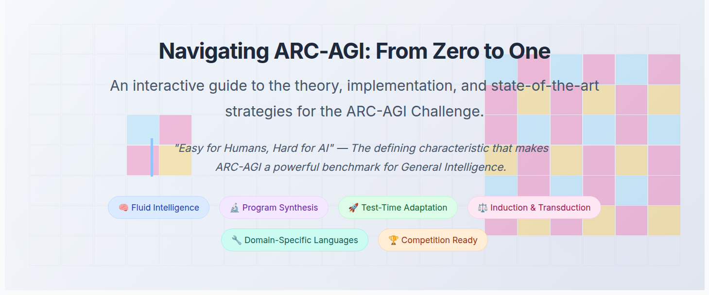

# Navigating ARC-AGI: From Zero to One

**Live Guide:** **[https://arahim3.github.io/arc-agi-guide/](https://arahim3.github.io/arc-agi-guide/)**

## About This Project

This is an interactive, single-page guide designed to help beginners get started with the **Abstraction and Reasoning Corpus (ARC-AGI) Challenge**. It synthesizes the core philosophy, key methodologies, winning strategies, and practical code from various community resources into one easy-to-digest format.

This guide was created as a personal learning project while preparing for the ARC Prize and is shared in the open-source spirit of the ARC community.

## Acknowledgments

This guide stands on the shoulders of giants. It is a summary and synthesis of the incredible work done by the creators and participants of the ARC Prize. Special thanks and attribution go to:

* **François Chollet** for creating the ARC-AGI benchmark.
* The **ARC Prize Foundation** for organizing the competition.
* The entire **Kaggle ARC community** for their public notebooks and discussions.
* The **2024 ARC Prize champions** whose papers and open-source solutions form the backbone of the strategic analysis in this guide.

---